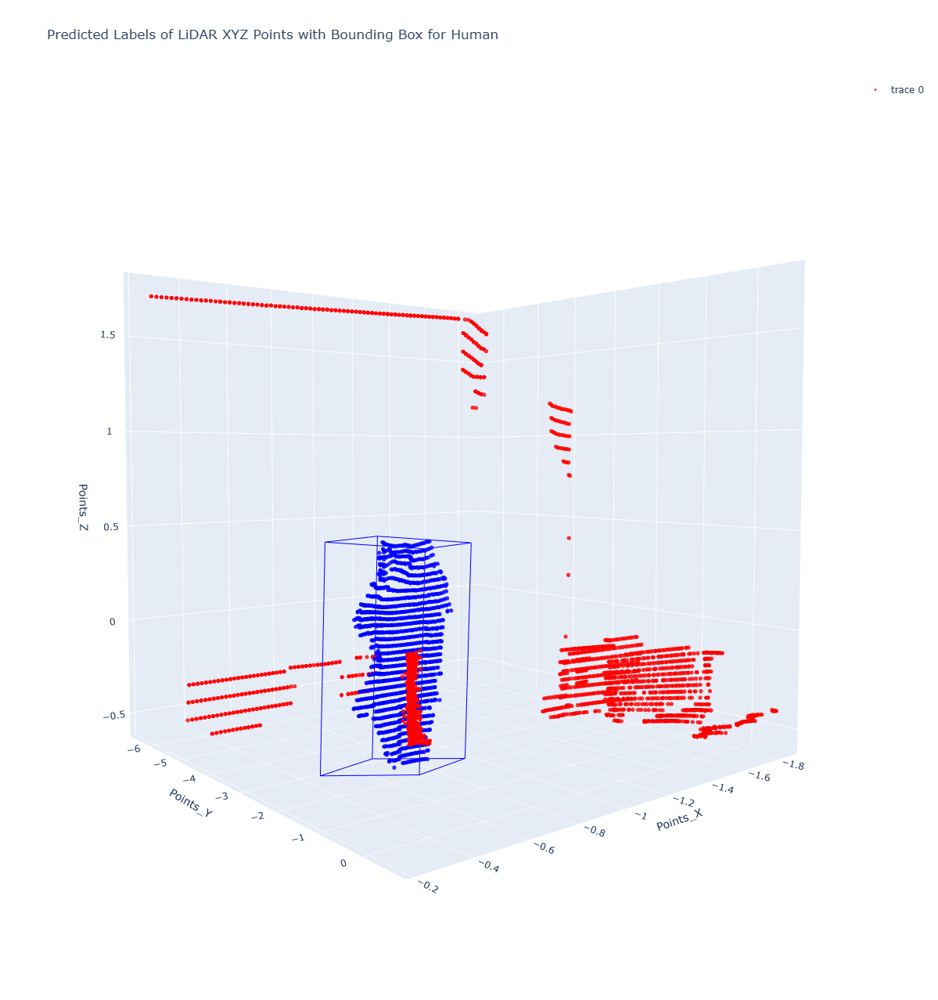

# Human Detection with LiDAR

## Overview

This repo contains a NN-based solution for LiDAR detection. The goal is to create a bounding box on humans detected.

## Set up Instructions

1. **Clone this repo**
First, clone this repo to your local machine:

`git clone https://github.com/giotaChita/LiDAR-Detection-NN.git`

`cd LiDAR-Detection-NN`

2. **Create conda environment**
The .yml file contains all the necessary dependencies

`conda env create -f environment.yml`

3. **Run the code**

In main there is a overview of the postprocessing of 3d points from LiDAR.

The model has been trained and tested in the file: 
`python model/model2.py`

## Configuration

The project uses the weights from the best training model and the best parameters are saved in the file below:

>data_path csv files: 
    ./data/
>best_model_params: 
    ./model/best_hyperparameters.json
>weights of best models:
    ./weights/cp.pt 
    ./weights/model2_weights.pt
    
    

## Demo

Example of detecting human and creating bbox. Output of NN:

